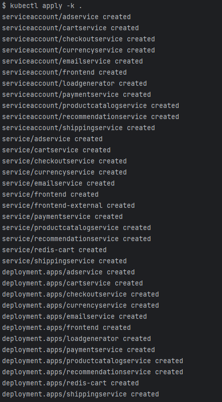
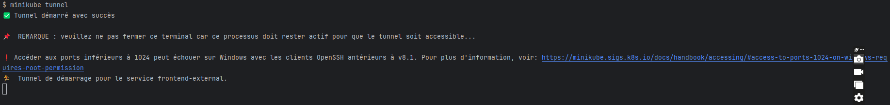
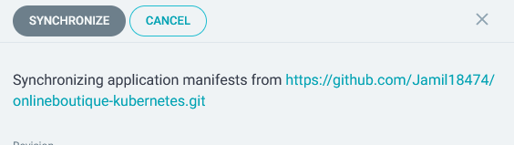

# Déploiement avec Minikube et Kustomize

Ce document fournit des instructions pour démarrer un cluster Kubernetes local à l'aide de Minikube et appliquer des configurations avec Kustomize.

## Prérequis

Avant de commencer, assurez-vous d'avoir installé les éléments suivants :

- [Minikube](https://minikube.sigs.k8s.io/docs/start/)
- [kubectl](https://kubernetes.io/docs/tasks/tools/install-kubectl/)
- [Docker Desktop](https://www.docker.com/products/docker-desktop)

## Instructions

1. **Lancer Docker Desktop :**

   Assurez-vous que Docker Desktop est en cours d'exécution avant de continuer.

2. **Démarrer Minikube avec Docker comme pilote :**

```bash
minikube start --driver=docker
```  


On voit bien que minikube a bien démarré avec l'aide de docker-desktop puisqu'on a bien précisé le driver docker dans la commande.

3. Vérifier l'état de Minikube :

```bash
minikube status
```


On voit bien que minikube est bien en marche

Appliquer les configurations avec Kustomize

1. Naviguer vers le répertoire contenant les fichiers Kustomize :


```bash
cd kustomize/
```


2. Appliquer les configurations Kubernetes :

```bash
kubectl apply -k .
```



On voit que tous les services sont bien créés.

Vérifier les ressources Kubernetes

Après avoir appliqué les configurations, vous pouvez vérifier l'état des différentes ressources :

Lister les pods :
```bash
kubectl get pods
```


Lister les services :
```bash
kubectl get services
```


Lister les déploiements :
```bash
kubectl get deployments
```


Tunnel Minikube

Pour accéder aux services exposés, vous pouvez créer un tunnel avec la commande suivante :

```bash
minikube tunnel
```



Cela vous permettra d'accéder aux services via leur adresse IP. Une fois le tunnel en cours d'exécution, l'application déployée sera accessible à l'adresse suivante :

Application déployée : http://localhost


# Déploiement avec ArgoCD

## Installation d'ArgoCD


## Exposition d'Argocd


## Récupération du mot de passe initial de l'admin


## Création de l'application via l'interface web d'ArgoCD


## Synchronisation de l'application via l'interface web d'ArgoCD




